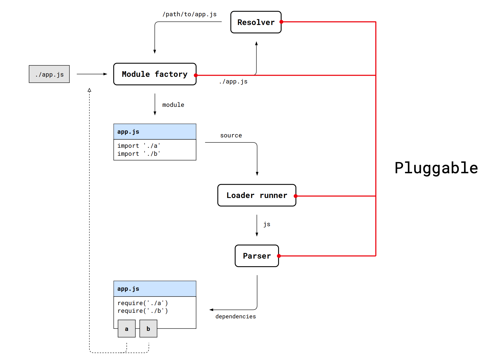

# Глубокое погружение в webpack 
https://www.youtube.com/watch?v=aiYkJOPD9v8

## Общая схема сборки

На входу файл, который имеет импорты. На выходе - один файл.

## Компилиция. Фаза создания графа зависимостей

Этапы:
- Module factory рекусивно создает дерево зависимостей на resolve 
- Зате дерево обрабатывается лодерами
    - Перед применением проходит pitch фаза(слева направо), на которой можно определить лодеры, которые можно опустить на фазе применения(лодер должен вернуть значение)
    - Лодеры запускаются справа налево
    - Работают только с одним файлом, строкой или буфером
    - Может передавать мета инфу
    - не хранит состояние, контекст сбрасывается перед каждым запуском
    - рез-т должен быть предсказуем
- Фаза парсинга. Извлечение зависимостей
- Результат граф

## Компилиция. Chunking

Chunk - часть графа зав-й, к. будет собран в отд файл после сборки

## Компилиция. Оптимизация

- Минификация, tree shaking
- Сортировка и удаления дублей
- генерация id

## Плагины

Позволяют вмешаться в любую стадию билда. Сложно и мала док.

Watch me too
https://www.youtube.com/watch?v=CA-upQKYjYc
https://www.youtube.com/watch?v=4tQiJaFzuJ8