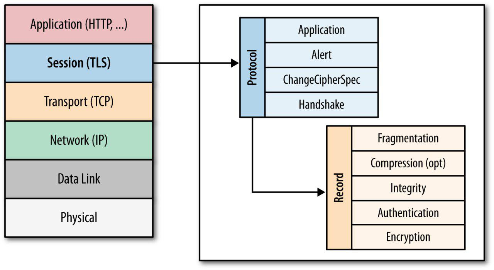
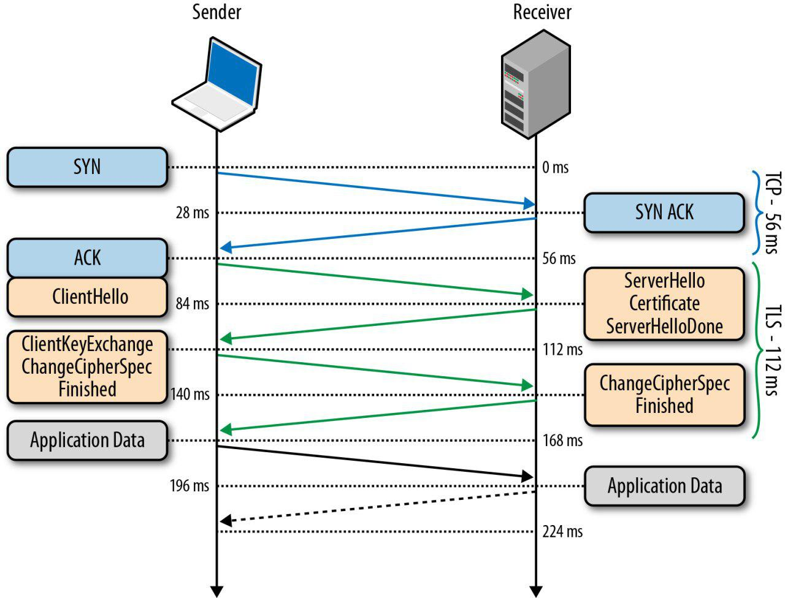
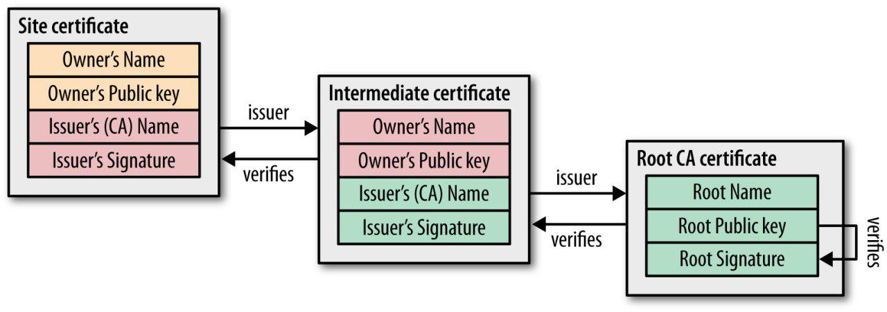

#сети

# HTTPS

**HTTPS** - расширение протокола HTTP для поддержки шифрования в целях повышения безопасности.

HTTPS не является отдельным протоколом. Это обычный HTTP, работающий через шифрованные транспортные механизмы протоколов SSL и TLS.

Протокол обеспечивает защиту от атак, основанных на прослушивании сетевого соединения — от снифферских атак и атак типа man-in-the-middle, при условии, что будут использоваться шифрующие средства и сертификат сервера проверен и ему доверяют.

По-умолчанию, используются порт 443, в отличие от HTTP(80й).

## TLS

Протокол TLS (transport layer security) основан на протоколе SSL (Secure Sockets Layer), изначально разработанном в Netscape для повышения безопасности электронной коммерции в Интернете. Протокол SSL был реализован на application-уровне, непосредственно над TCP (Transmission Control Protocol), что позволяет более высокоуровневым протоколам (таким как HTTP или протоколу электронной почты) работать без изменений.

В 2014 году правительство США сообщило об уязвимости в текущей версии протокола SSL. SSL должен быть исключён из работы в пользу TLS.

Протокол **TLS предназначен** для обеспечения:

- Конфидециальности инф-ции за счет криптографически безопасного канала данных, узлы соединения должны согласовать используемые методы шифрования и ключи.

- Аутентификации - механизм Chain of Trust

- Целостность каждое сообщение подкреплено кодом MAC(checksum)

**TLS Handshake** - согласование парам-в соединения:
- версия протокола
- способ шифрования данных
- проверка сертификатов, если это необходимо

Шаги:
1. Установка TCP-соединения клиент-сервер
2. Клиент посылает на сервер спецификацию в виде текста (версию протокола, которую он хочет использовать, поддерживаемые методы шифрования, etc)
3. Сервер утверждает версию протокола, выбирает способ шифрования из списка клиента, прикрепляет свой сертификат и отправляет ответ клиенту (опционально сервер может запросить сертификат клиента)
4. Клиент проверяет сертификат сервера и инициирует либо RSA, либо обмен ключами по Диффи-Хеллману(зависит от уст-х парам-в)
6. Обработка сервером присланного клиентом сообщения, сверка MAC кода, и отправка клиенту закл-го ('Finished') сообщение в зашифрованном виде.
7. Клиент расшифровывает полученное сообщение, сверяет MAC, и если всё хорошо, то соединение считается установленным и начинается обмен данными приложений.

### TLS Chain of trust

**TLS chain of trust** - механзим аутентификации, способ проверки подлиности от самого низа до корня некой иерархии.

В сценарии обмена сообщениями, когда у пользователей есть пары ключей приватный и публичный, пользователи могут быть уверенным в аутентичности сообщении. Они обмениваются сообщениями зашифрованными приватным ключами. Конечно, при условии, что обмен публичным ключами произошел безопасным способом.

След сценарий:
- Участник C утверждает, что знает участника общения, участника А. C имеет публичный ключ, к подписан приватным ключом А.
- Участник Б получает сообщение от С, к сообщению прикрпелена подпись. Сначала Б проверяет подпись A на ключе C (это она в состоянии сделать, ведь открытый ключ A ей уже известен). Затем делает проверку целостности.

В протоколе TLS данные цепи доверия основаны на сертификатах подлинности, предоставляемых специальными органами, называемыми центрами сертификации (CA – certificate authorities). Центры сертификации производят проверки и, если выданный сертификат скомпрометирован, то данный сертификат отзывается.

Из выданных сертификатов складывается уже рассмотренная цепочка доверия. Корнем её является так называемый “Root CA certificate” – сертификат, подписанный крупным центром, доверие к которому неоспоримо.

При построении цепочки доверия, необходимо проверять актуальность каждого доверительного узла, выснить не был ли скомпровентирован и отозван один сертификатов.

Каждый из центров сертификации имеется CRL – «Certificate Revocation List», представляющий простой перечень серийных номеров отозванных сертификатов. Соответственно любой, кто хочет проверить подлинность сертификата, попросту загружает данный список и ищет в нём номер проверяемого сертификата. Если номер обнаружится – это значит, что сертификат отозван.

Для проверки лишь одного сертификата требуется запрашивать весь список отозванных сертификатов, что влечёт замедление работы. Для борьбы с этим был разработан механизм под названием «Протокол статусов сертификатов» (OCSP – Online Certificate Status Protocol). Он позволяет осуществлять проверку статуса сертификата динамически. Естественно, это снижает нагрузку на пропускную способность сети, но в то же время порождает несколько проблем:

- Центры сертификации должны справляться с нагрузкой в режиме реального времени;
- Центры сертификации должны гарантировать свою доступность в любое время;
- Из-за запросов реального времени центры сертификации получают информацию о том, какие сайты посещал каждый конкретный пользователь.

Собственно, во всех современных браузерах оба решения (OCSP и CRL) дополняют друг друга, более того, как правило имеется возможность настройки предпочитаемой политики проверки статуса сертификата.