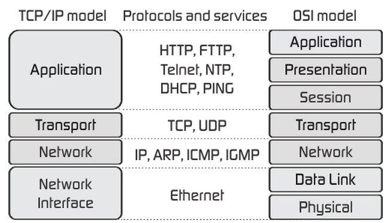

\#сети

# Сетевая модель

**Сетевая модель** - теор описание принципов описания работы принципы работы сетевых протоколов и их взаимодействия.

## Модель OSI 
Цель: стандратизация.

7 уровней и каждого своя роль и задачи:

1. Физический
Определяет метод передачи данных, среду (элетронные сигналы, световые импульсы, радио), метод кодироваиня двоич сигнала.

2. Канальный
Выполняет задачу адресации в пределах локальной сети, поиск ошибок, проверка целостности данных.
Уровень MAC-адресов и протокола Ethernet.

3. Сетевой
Задача: объединения участков сети и поиск оптимального маршрута передачи. Каждое сет устр-во должно иметь уник адрес.
Уровень протоколов ipv6, ipv4

4. Транспортный
Функция траснпорта, например, передача файла по сегментам. Также на этом уровне вводится понятие портов, которые нужны для указания назначения к каждой конкретной службе.
Уровень протоколов TCP, UDP

5. Сеансовый
Установление, управление, разрыв соединений между хостами.

6. Уровень представления
Стркутурируют информация в читабельный вид для протокола приклданого уровня.

7. Прикладной
HTTP, FTP и тп

Нельзя перескакивать с через уровени. Нужно следовать строго уровень-за-уровнем в одном направлении, либо сверху вниз, либо снизу вверх.

**Инкапсуляция** - процесс движения сверху вниз, **деинкапсуляция** - снизу вверх.

Также на каждом уровне передаваемая информация называется по разному:

- На прикладном, представления и сеансовым уровнях, передаваемая информация обозначается как PDU (Protocol Data Units)
- Информацию транспортного уровня называют сегментами. Хотя понятие сегменты, применимо только для протокола TCP. Для протокола UDP используется понятие — датаграмма. Но, как правило, на это различие закрывают глаза.
- На сетевом уровне называют IP пакеты или просто пакеты.
- на канальном уровне — кадры

## Модель TCP/IP

Уровни:

- Прикладной. Уровень работы приложений
- Траспортный. Приложение/служба имеет порт, к. оно прослушивает и по нему можно с ним связаться.
- Сетевой. На этом ур-не IP адреса(или лог адрес устр-ва сети)
- Канальный ур-нь(сет интерфейс) - сет. карта, антена, тп, у которых есть физический адрес. Это среда, к. свзяжет учатсников сети.

Прикладной
С тз модели OSI прикладной уровень объединяет физ и канальный уровни.

Физический ур-нь задает параметыр сигнала. Примеры:
- Ethernet, кабель. Параметры => модуляция, напряжение, ток
- wi-fi. Параметры => радио волны, частота, амплитуда

К этому уровню можно отнести сетевые карты, Wi-Fi антенны, коннекторы. На этом уровне вводится такое понятие, как биты. Это единица измерения передаваемой информации.

Канальный уровень
Передача осмысленная посл-ти битов. Тут используются MAC-адреса, или физические.

